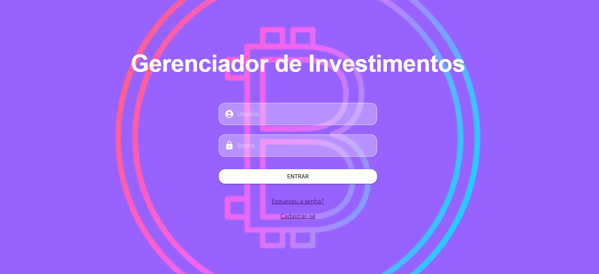

## 💰 Sistema Gerenciador de Investimentos (Web)

Projeto desenvolvido para fins educacionais, com o objetivo de praticar todos os conhecimentos adquiridos no curso de Análise e Desenvolvimento de Sistemas.

**🎯 Objetivo do Projeto**

O Sistema Gerenciador de Investimentos foi desenvolvido para facilitar a análise e o acompanhamento de investimentos, permitindo ao usuário registrar seus ativos, visualizar gráficos comparativos e acompanhar a evolução dos rendimentos ao longo do tempo.
O objetivo principal é oferecer uma interface clara, moderna e informativa, auxiliando o investidor na tomada de decisão sobre sua carteira de investimentos.

**🖋️ Arquitetura do Sistema**

A aplicação foi construída seguindo o modelo de Arquitetura em 3 Camadas: Front-End — Interface de interação com o usuário. Back-End — Camada da API REST. Banco de Dados — Armazenamento de dados. 

*Front-End:* Foi desenvolvido em React.js com Material UI (MUI) para o design da interface, responsivo, dinâmico e voltado à experiência do usuário. Além disso, foi utilizado Chart.js para os gráficos interativos.

*Back-End:* Foi implementado com Node.js e Express, estruturado como uma API RESTful. É responsável pela autenticação, manipulação dos dados e integração com o banco. Faz a comunicação com o Front-End via JSON.

*Banco de Dados:* O Banco MongoDB foi utilizado para armazenar dados dos usuários e investimentos. O Mongoose foi utilizado para modelagem e manipulação das coleções.

**🗂️ Requisitos Implementados e Principais funcionalidades**

*Cadastro de ativos* – Permite registrar investimentos como CDBs, LCIs, LCAs e fundos, incluindo informações como nome, categoria, valor inicial, taxa e data de aquisição.

*Atualização de saldos* – O usuário pode inserir valores atualizados periodicamente para acompanhar o crescimento dos ativos.

*Cálculo automático de rendimento* – O sistema calcula automaticamente o percentual de ganho acumulado.

*Gráficos comparativos* – Exibe o desempenho de cada ativo de forma visual e interativa.

*Autenticação via JWT* – Garante a segurança nas requisições e proteção dos dados do usuário.

**🤖 Tecnologias Utilizadas**

*Front-End:*	React.js, Material UI (MUI), Chart.js

*Back-End:*	Node.js, Express, JWT

*Banco de Dados:*	MongoDB, Mongoose

**🧠 Desenvolvido por**

Luiza Matilha Sacom, Italo Francisco Magdalena, Felipe Martins Lucio e Denis Rodrigues Rocha

---

### 📸 Print da Aplicação

